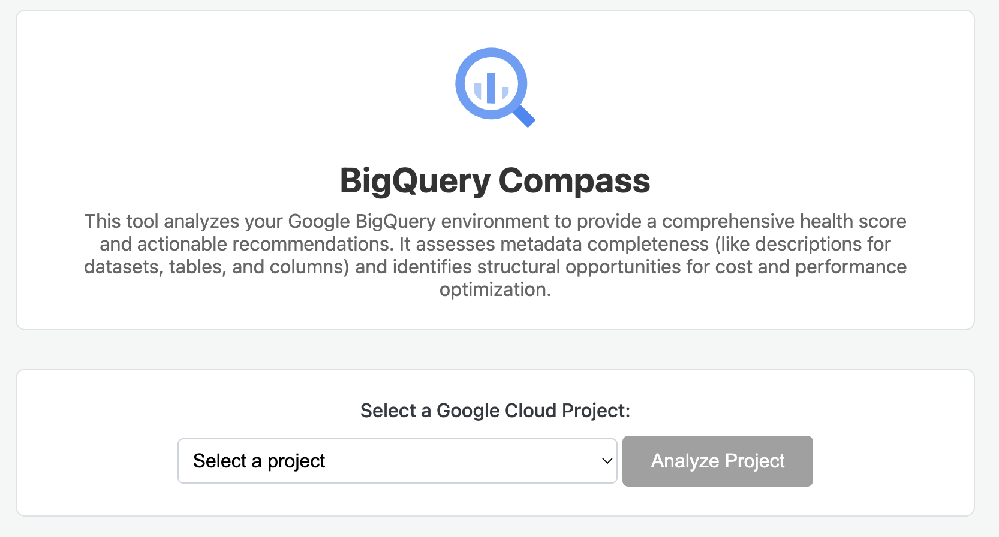

# BigQuery Compass

This application uses a multi-agent AI system to perform a comprehensive analysis of a Google BigQuery environment. It provides an overall health score, detailed findings, and interactive, AI-powered recommendations to help you optimize for cost, performance, and metadata best practices.



## Features

- **Dynamic Project Selection**: Automatically discovers and lists all accessible Google Cloud projects.
- **Comprehensive Health Score**: Generates a 0-100 health score based on a detailed analysis of your datasets and tables, presented in an easy-to-read gauge.
- **Prioritized Key Findings**: Uses AI to identify key issues and best practices in your environment. Findings are categorized by importance (High, Medium, Low) and displayed in an interactive accordion UI.
- **AI-Powered Action Plans**: For each recommendation, you can generate a detailed, step-by-step action plan. A specialized AI agent performs a live Google search to find the most up-to-date documentation and best practices, then synthesizes this information into a concrete plan tailored to your project's context.
- **Recommended Reading**: Automatically suggests relevant articles and documentation to deepen your understanding of the identified issues and best practices.
- **Real-time Progress**: A live-updating progress bar and checklist show you exactly what the analysis is doing in the background.

## What Data is Analyzed?

This application operates on a **read-only** basis and prioritizes data privacy. It **does not access, read, or download the actual data** stored inside your BigQuery tables. All analysis is performed exclusively on metadata retrieved from the BigQuery `INFORMATION_SCHEMA`.

Specifically, the application fetches the following metadata for each dataset in the selected project:

*   **Dataset Metadata**:
    *   Dataset DDL (Data Definition Language) to check for the presence of a dataset description.
*   **Table Metadata**:
    *   Table names, types (e.g., `BASE TABLE`, `VIEW`), and DDL.
    *   Table and column descriptions.
    *   Partitioning and clustering configurations.
    *   Last modified times (to identify potentially stale tables).
    *   Storage metrics, including logical size, physical size (billable bytes), and row counts.
*   **Project Listing**:
    *   The application uses the Google Cloud Resource Manager API to list the projects your authenticated account has access to, which populates the project selection dropdown.

This collected metadata is then provided to the AI agents for analysis and report generation. The "Action Plan" and "Recommended Reading" features use a separate AI agent that performs Google searches for relevant public documentation.

## Technology Stack

- **Backend**: Python with FastAPI and `google-adk` (Google's Agent Development Kit).
- **AI Model**: Google Gemini 2.5 Flash.
- **Frontend**: Vanilla JavaScript, HTML5, and CSS3. No frameworks.
- **Dependency Management**: Poetry.

## Setup

#### 1. Prerequisites
- Python 3.9+
- [Poetry](https://python-poetry.org/docs/#installation) for package management.
- [Google Cloud SDK](https://cloud.google.com/sdk/docs/install) installed and authenticated.

#### 2. Clone the Repository
```bash
git clone <repository-url>
cd <repository-name>
```

#### 3. Install Dependencies
Use Poetry to install all the required Python packages.
```bash
poetry install
```

#### 4. Set Up Google Cloud Authentication
Log in with your Google Cloud account to grant the application access to your projects.
```bash
gcloud auth application-default login
```

#### 5. Configure Environment Variables
Create a file named `.env` in the root of the project. This file will store your API keys and project settings.

```env
# .env

# Your Google Cloud Project ID (this is used as a fallback for authentication)
# The application will analyze the project you select in the UI.
GOOGLE_CLOUD_PROJECT="your-default-gcp-project-id"

# The default region for your BigQuery datasets.
GOOGLE_CLOUD_REGION="your-gcp-region" # e.g., us-central1, EU

# Your Gemini API Key from Google AI Studio.
GEMINI_API_KEY="your-gemini-api-key"
```

## How to Run

1.  **Start the Backend Server**

    From the root directory of the project, run the following command. This will start the FastAPI server on `http://localhost:8000` with hot-reloading enabled.

    ```bash
    poetry run start
    ```

2.  **Run the Frontend**

    Open a **new terminal window** (leave the backend server running) and run the following command from the project's **root directory**. This starts a simple web server for the frontend.

    ```bash
    python3 -m http.server --directory frontend 8080
    ```
    
    Now, open your browser and navigate to `http://localhost:8080`.

    The application will load, fetch your Google Cloud projects, and be ready for analysis. 